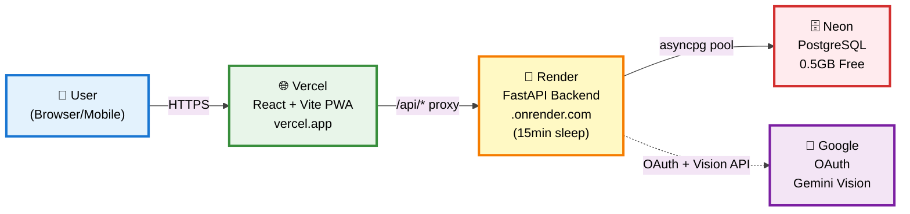
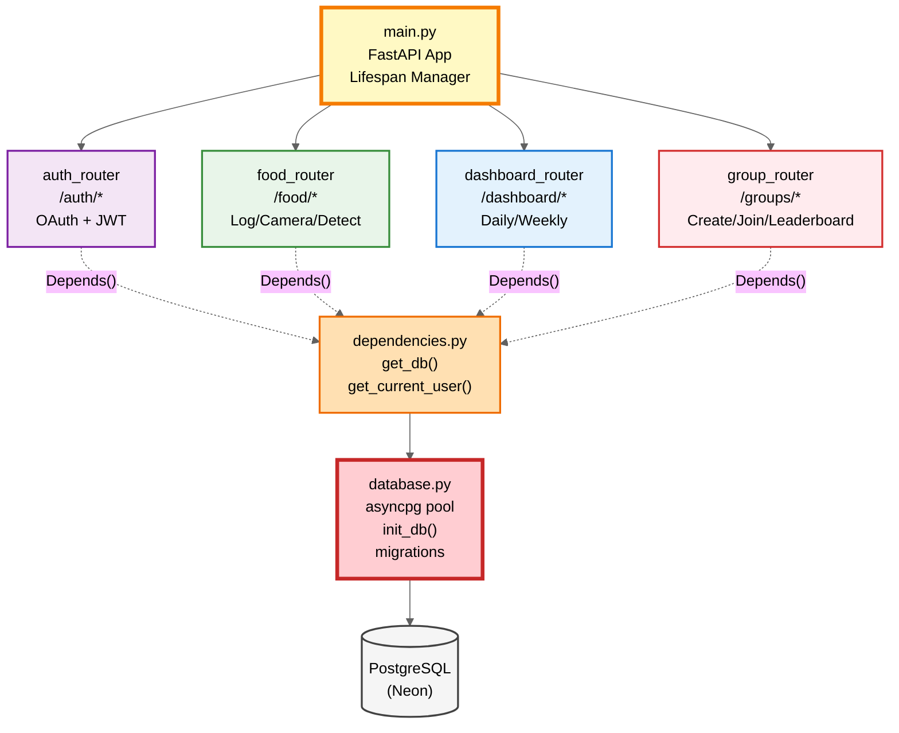
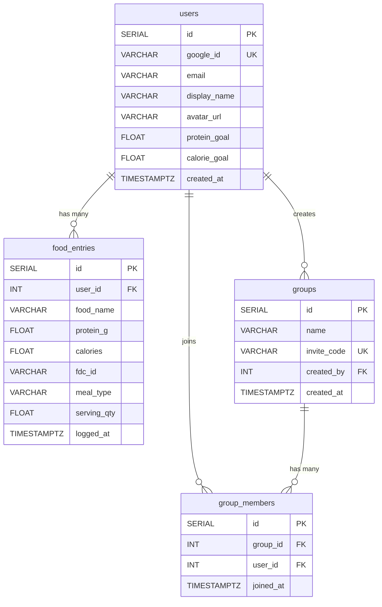
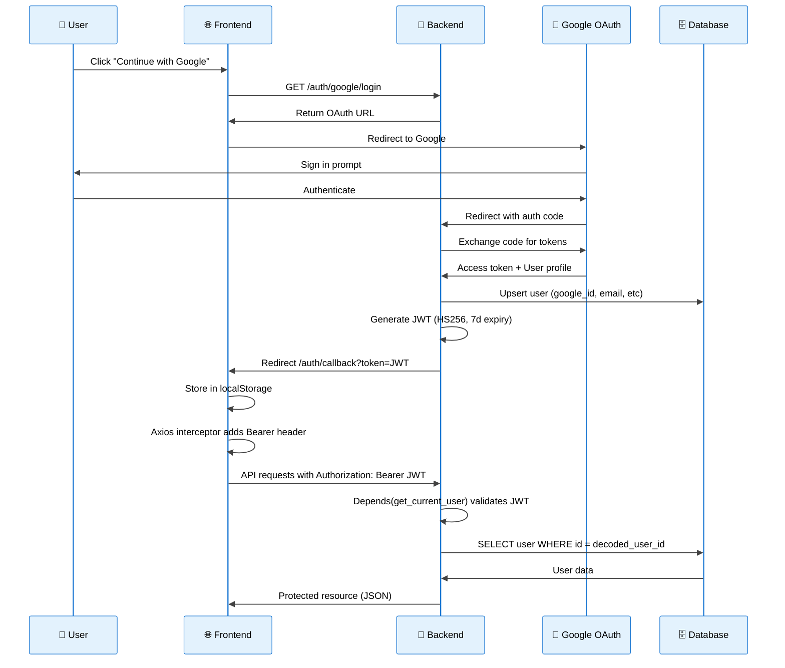
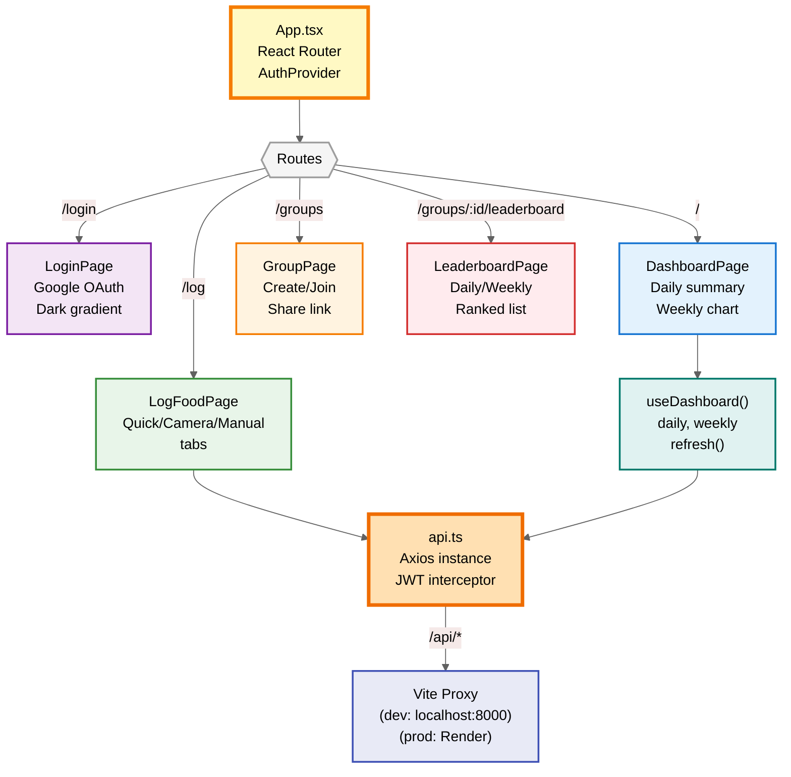
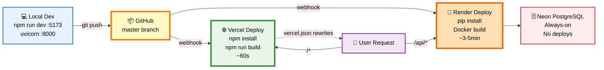

# Architecture Documentation

This document provides visual architecture diagrams for the Protein & Calorie Tracker PWA using Mermaid diagrams that render directly on GitHub.

## 1. System Overview



**💰 Total Cost: $0/month** (All free tiers)
**⚡ Auto-deploy:** Git push to master → Vercel + Render webhooks

---

## 2. Backend Architecture



**Request Flow:**
```
Client → Router → Depends(get_current_user) [JWT validate] →
Depends(get_db) [pool.acquire()] → Business Logic →
DB Query ($1, $2... params) → Pydantic Response → JSON
```

---

## 3. Database Schema



**Key Notes:**
- All timestamps use `TIMESTAMPTZ` (timezone-aware)
- Indexed columns: `google_id`, `(user_id, logged_at)`, `invite_code`, `(group_id, user_id)`
- asyncpg requires **date objects** (not ISO strings) for DATE queries
- Auto-initialized via `database.py` on FastAPI startup

---

## 4. Authentication Flow



**Protected Route Flow:**
```
Every API request → Axios adds "Authorization: Bearer <JWT>" →
Backend Depends(get_current_user) → decode_jwt() validates signature & expiry →
Extract user_id from payload → SELECT user from DB → Return user dict →
Route handler receives authenticated user
```

---

## 5. Frontend Architecture



**Data Flow:**
```
Page → useAuth/useDashboard → api.ts (Axios) → JWT interceptor adds Bearer token →
Vite proxy /api → Render backend → asyncpg → PostgreSQL → JSON response →
Pydantic types → React state update → UI re-render
```

---

## 6. Deployment & CI/CD



**Production Request Flow:**
```
User → https://protein-calorie-tracker.vercel.app
  ↳ Static assets (HTML/JS/CSS) → Vercel CDN (instant)
  ↳ API calls /api/* → Vercel rewrites to Render backend
    ↳ Render (may cold-start ~30s if sleeping)
      ↳ asyncpg pool → Neon PostgreSQL (serverless, instant)
        ↳ JSON response → Vercel → User

SPA routes (/, /log, /groups) → Vercel serves index.html → React Router handles routing
```

**Environment Variables (Render):**
```bash
GOOGLE_CLIENT_ID=...
GOOGLE_CLIENT_SECRET=...
JWT_SECRET=...
GEMINI_API_KEY=...
FRONTEND_URL=https://protein-calorie-tracker.vercel.app
DATABASE_URL=postgresql://...neon.tech/neondb?sslmode=require
```

---

## Technology Stack

### Frontend
- **React 18** + TypeScript
- **Vite** (build tool + dev server)
- **React Router** (client-side routing)
- **Tailwind CSS** (styling)
- **Axios** (HTTP client with JWT interceptor)
- **PWA** (manifest.json + service worker)

### Backend
- **FastAPI** (Python async web framework)
- **asyncpg** (PostgreSQL async driver)
- **Pydantic** (data validation)
- **Google OAuth 2.0**
- **JWT** (HS256 algorithm)
- **Google Gemini Vision API**

### Infrastructure
- **Vercel** (frontend hosting, CDN)
- **Render** (backend hosting, Docker)
- **Neon** (serverless PostgreSQL)
- **GitHub** (source control + webhooks)

---

## Key Patterns & Gotchas

### 1. Timezone Handling
- Frontend sends **local datetime/date** to backend
- Backend uses `TIMESTAMPTZ` for all timestamps
- asyncpg requires Python `date` objects (not ISO strings) for DATE queries
- Frontend: `toLocalDateStr()` helper converts Date → YYYY-MM-DD

### 2. JWT Flow
- OAuth callback → JWT issue → `localStorage` → Axios interceptor → Bearer header
- 7-day expiry, HS256 algorithm
- Payload: `{user_id: int, exp: timestamp}`

### 3. Dependency Injection
- FastAPI `Depends()` for db connection pooling and auth
- `get_db()` → `pool.acquire()` → yields connection
- `get_current_user()` → JWT validation → returns user dict

### 4. PWA Features
- Service worker + manifest for installable app
- iOS: Manual "Add to Home Screen" (Safari only)
- Android: Automatic install prompt

### 5. asyncpg Gotchas
- Numbered params: `$1, $2, $3...` (not `?`)
- Date objects: `date.fromisoformat(str)` for queries
- `RETURNING id` with `fetchval()` instead of `lastrowid`
- `Record` objects: dict-like, use `.isoformat()` for datetimes

---

## File Structure

```
protein-calorie-tracker/
├── frontend/
│   ├── src/
│   │   ├── pages/          # Route components
│   │   ├── components/     # Reusable UI
│   │   ├── hooks/          # Custom React hooks
│   │   ├── context/        # AuthContext
│   │   ├── api.ts          # Axios + JWT interceptor
│   │   └── main.tsx
│   ├── vercel.json         # Vercel rewrites
│   └── vite.config.ts      # Vite proxy + PWA
├── backend/
│   ├── routers/            # 4 API route modules
│   │   ├── auth_router.py
│   │   ├── food_router.py
│   │   ├── dashboard_router.py
│   │   └── group_router.py
│   ├── main.py             # FastAPI app + lifespan
│   ├── database.py         # asyncpg pool + migrations
│   ├── dependencies.py     # get_db, get_current_user
│   ├── auth.py             # JWT + OAuth
│   ├── gemini_client.py    # Vision API
│   ├── seed.py             # Common foods seeder
│   └── models.py           # Pydantic models
└── docs/
    ├── ARCHITECTURE.md     # This file
    └── *.excalidraw        # Editable diagrams
```

---

## Links

- **Live App**: https://protein-calorie-tracker.vercel.app
- **Backend**: https://protein-calorie-tracker.onrender.com
- **GitHub**: https://github.com/shra1-honade/protein-calorie-tracker
- **API Docs**: https://protein-calorie-tracker.onrender.com/docs
